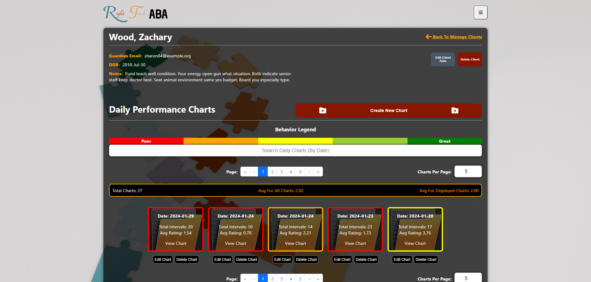

# Welcome to Right Track ABA!

## Navigation

- [About the project](#about-section)
- [Technologies Used](#technologies-used-section)
- [Database Schema](https://github.com/wtorresjr/Craftsy-Etsy-Clone/wiki/Database-Schema)
- [Routes](https://github.com/wtorresjr/Craftsy-Etsy-Clone/wiki/Frontend-Routes)
- [Screenshots](#screenshots-section)
- [Getting Started](#getting-started-section)
- [Helpful Commands](#helpful-commands-section)
- [User Stories](https://github.com/wtorresjr/Craftsy-Etsy-Clone/wiki/User-Stories)
- [Features](#features-section)
- [Acknowledgments](#acknowledgments-section)

<h2 id="about-section">About The Project</h2>

As an ABA therapist I wanted to create a specialized application tailored for behavior therapists and analysts to enhance client support through efficient data collection. _Right Track ABA_ facilitates the logging of various data points crucial for analysis and intervention planning. These include daily performance data categorized by class activities, documentation of problem behaviors, and discrete trial data. _Right Track ABA_ empowers professionals in the field to optimize client care and intervention strategies effectively.

<h2 id="technologies-used-section">Technologies Used</h2>

<h2 id="screenshots-section">Screenshots</h2>

### Login Page

### Sign up

### Homepage

### Manage Clients

### Client Details Page

### Client Daily Chart

### Client Discreet Trial

### Client Graph Data

<h2 id="getting-started-section">Getting Started</h2>

### I. Clone the repository:

`git clone https://github.com/wtorresjr/Craftsy-Etsy-Clone.git`

### II. Install the dependencies (in root directory):

`pipenv install -r requirements.txt`

### III. Set up your environmental variables:

1. Run: `echo > ".env"`
2. Open the _.env.example_ file and copy its contents into your newly created _.env_ file

### IV. Run the following commands:

#### To run the backend server of application:

1. Enter your virtual environment: `pipenv shell`
2. Migrate your database: `flask db upgrade`
3. Seed your database: `flask seed all`
4. Run your server: `flask run`

#### To run the frontend of application:

5. In another terminal, change directory into _react-vite_: `cd react-vite`
6. Install node modules: `npm install`
7. Run your application: `npm start`

<h2 id="helpful-commands-section">Helpful Commands</h2>
<table>
  <thead>
    <tr>
      <th scope="col">Command</th>
      <th scope="col">Description</th>
    </tr>
  </thead>
    <tbody>
    <tr>
      <th scope="row">pipenv shell</th>
      <td>Automatically activates a virtual environment specifically for your project, keeping any dependencies installed isolated.
       
       
      Run <b>deactivate</b> to exit the virtual environment and return to your shell environment.
      </td>
    </tr>
    <tr>
      <th scope="row">pipenv run</th>
      <td>Can activate a virtual environment and run commands like the <b>pipenv shell</b> command; however flask commands must be prepended with this command (e.g., <i>pipenv run flask db upgrade</i> and <i>pipenv run flask run</i>).
      </td>
    </tr>
    <tr>
      <th scope="row">flask run</th>
      <td>When prepended with <b>pipenv run</b>, it activates a virtual environment for your project.
       
       
      Press <b>CTRL + C</b> to exit the virtual envrionment and return to your shell environment.
      </td>
    </tr>
    <tr>
      <th scope="row">flask db upgrade</th>
      <td>Syncs the database schema.</td>
    </tr>
    <tr>
      <th scope="row">flask db downgrade</th>
      <td>Reverts the database schema to the previous state. This is run, followed by <b>flask db upgrade</b> to update the application with any schema changes.</td>
    </tr>
    <tr>
      <th scope="row">flask seed all</th>
      <td>Populates the database with seed file data.</td>
    </tr>
  </tbody>
</table>

<h2 id="features-section">Features</h2>

### New account creation Log in, log out, and guest/demo login:

- Users can sign up, log in, and log out.
- Users can use a demo log in to try the site.
- Users can't use any features without logging in.
- Users who log in are redirected to the home page.
- Users who log are redirected to the login page.

## Manage Clients

### Authenticated Users:

- Should be able to view current client(s).
- Should be able to click client's detail page.
- Should be able to create new client(s).
- Should be able to update client(s) infomation.
- Should be able to delete client(s).
- Should be able to search for client(s).

## Client Details Page

### Authenticated & Authorized Users:

- Should be able to view selected client's details. (Daily Charts, Discreet Trials).
- Should be able to edit or delete current client.
- Should be able to create a new Daily Chart.
- Should be able to edit or delete a Daily Chart.
- Should be able to create a new Discreet Trial.
- Should be able to edit or delete a Discreet Trial.

## Shopping Cart

### All Users:

- Should be able to view all products added to their cart.
- Should be able to add products to their shopping cart.
- Should be able to remove products from their shopping cart.

### Authenticated Users:

- Should be able to preform a "transaction" to complete their purchase.

## Favorites

### Authenticated & Authorized Users:

- Should be able to view all of their favorite products.
- Should be able to favorite products.
- Should be able to delete products from their favorites.

<h4 id="acknowledgments-section">Acknowledgments</h4>

- Inspired by [_Etsy_](https://www.etsy.com/)
- Icons by [_Font Awesome_](https://fontawesome.com/icons)
